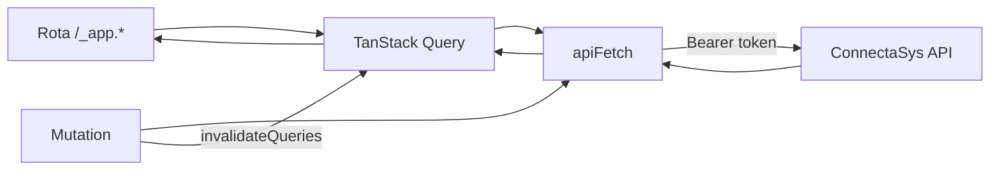
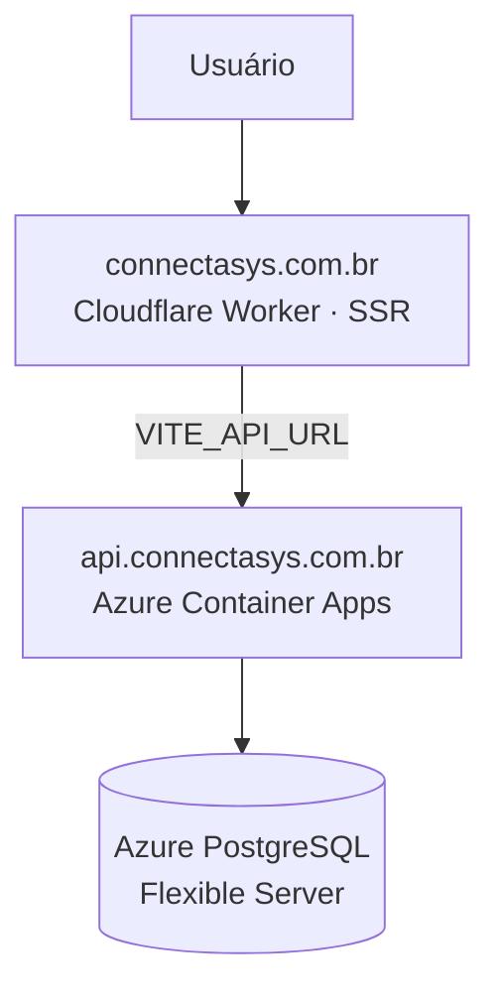

<div align="center">

# ⚙️ ConnectaSys Hub

**O painel do ConnectaSys** — landing page, login e o sistema completo de gestão de oficinas mecânicas, consumindo a [ConnectaSys API](https://github.com/Paulocergio/connectasys_api).


🌐 **[connectasys.com.br](https://connectasys.com.br)**

</div>

---

## 📑 Sumário

- [Visão geral](#-visão-geral)
- [Telas implementadas](#-telas-implementadas)
- [Stack](#-stack)
- [Arquitetura](#-arquitetura)
- [Autenticação e sessão](#-autenticação-e-sessão)
- [Integração com a API](#-integração-com-a-api)
- [Design system](#-design-system)
- [Como rodar](#-como-rodar)
- [Deploy](#-deploy)
- [Specs](#-specs-spec-driven-development)
- [Roadmap](#-roadmap)

---

## 🎯 Visão geral

O **ConnectaSys Hub** é o frontend do ConnectaSys: um SaaS multitenant de gestão para oficinas mecânicas. Ele entrega três superfícies em uma única aplicação:

| Superfície | Rota | O que é |
|:--|:--|:--|
| 🚀 **Landing page** | `/` | Apresentação do produto, recursos, planos e FAQ — tema escuro fixo |
| 🔑 **Acesso** | `/auth` | Login contra a API real, com aba de cadastro de oficina |
| 🧭 **Painel** | `/dashboard` e demais | Área logada com sidebar retrátil, dark/light mode e os módulos operacionais |

Todo o dado exibido vem da **ConnectaSys API** — não há mais mock local nos módulos migrados. A aplicação roda com SSR via TanStack Start e é publicada como um **Cloudflare Worker**.

---

## ✅ Telas implementadas

| Módulo | Rota | Recursos |
|:--|:--|:--|
| 🚀 **Landing** | `/` | Hero animado, marquee de oficinas, grid de recursos, 3 planos, FAQ em accordion, blobs e preview do produto |
| 🔑 **Login** | `/auth` | Autenticação real via `POST /api/Auth/login`, mensagens de erro da API, toast de boas-vindas |
| 📊 **Dashboard** | `/dashboard` | OS abertas e atrasadas, clientes ativos, peças em estoque baixo e faturamento do mês — calculados ao vivo |
| 👤 **Clientes** | `/clientes` | CRUD + busca, CPF/CNPJ com validação e **autopreenchimento por CNPJ (BrasilAPI) e CEP (ViaCEP)** |
| 🚗 **Veículos** | `/veiculos` | CRUD + busca, vínculo com cliente, tipo de veículo e **validação de placa (padrão antigo e Mercosul)** |
| 🧾 **Ordens de Serviço** | `/ordens-servico` | CRUD completo, itens da OS (avulsos ou puxados do estoque), desconto percentual, aprovação do cliente e **impressão da OS** |
| 📦 **Estoque** | `/estoque` | CRUD de peças, preço de compra/venda e destaque de **estoque abaixo do mínimo** |
| 💸 **Contas a Pagar** | `/contas-a-pagar` | CRUD + busca, baixa com forma de pagamento e badge de status |
| 💰 **Contas a Receber** | `/contas-a-receber` | CRUD + busca, vínculo com cliente e OS, baixa com forma de pagamento |
| 🧑‍🔧 **Usuários** | `/usuarios` | CRUD + busca, seleção de perfil e badge por role |
| 🎨 **Tema** | (global) | Alternância dark/light na sidebar, **persistida no perfil do usuário** via API |

---

## 🛠️ Stack

| Camada | Tecnologia |
|:--|:--|
| Framework | **TanStack Start** (SSR) + **TanStack Router** (rotas por arquivo) |
| UI | **React 19** + **Tailwind CSS v4** + **shadcn/ui** (Radix primitives) |
| Ícones | **Lineicons** (`@lineiconshq/react-lineicons`), reexportados por `src/components/icons.tsx` |
| Dados | **TanStack Query** — cache, invalidação e mutations |
| Validação | **Zod** + **react-hook-form** |
| Feedback | **Sonner** (toasts) |
| Gráficos | **Recharts** |
| Build | **Vite 8** + Nitro (preset Cloudflare) |
| Qualidade | ESLint 9 + Prettier |
| Hospedagem | **Cloudflare Workers** |

---

## 🏗️ Arquitetura

```
connectasys-hub
│
├── src/routes/                   → Rotas (file-based routing do TanStack Router)
│   ├── __root.tsx                  → Providers globais, <head>, 404 e error boundary
│   ├── index.tsx                   → Landing page (pública, SSR)
│   ├── auth.tsx                    → Login e cadastro (pública)
│   ├── _app.tsx                    → Layout protegido: sidebar, tema, avatar, logout
│   └── _app.<modulo>.tsx           → Uma rota por módulo do painel
│
├── src/components/
│   ├── ui/                         → shadcn/ui — genéricos, nunca alterados por caso de uso
│   ├── landing/                    → Blob, Marquee, OficinaIllustration, ProductPreview
│   ├── icons.tsx                   → Camada única de ícones (troca de biblioteca em 1 arquivo)
│   └── *-badge.tsx                 → Badges de status, role e forma de pagamento
│
├── src/lib/
│   ├── api.ts                      → Cliente HTTP: base URL, Bearer token, erros, 401
│   ├── connecta-store.tsx          → Contexto de sessão (login / logout / usuário atual)
│   ├── tema.ts                     → Hook de tema, com persistência no perfil
│   └── utils.ts · initials.ts      → Helpers compartilhados
│
├── src/styles.css                  → Tokens de cor em oklch (dark + light) e regras de impressão
└── specs/                          → Constituição + specs de cada feature (fluxo SDD)
```

### 🔄 Fluxo de dados



Cada tela segue o mesmo padrão: `useQuery` para listar, `useMutation` para criar/editar/excluir, `invalidateQueries` para refazer a listagem e `toast` para o retorno ao usuário — o erro exibido é a **mensagem que a própria API devolveu**.

---

## 🔐 Autenticação e sessão

```mermaid
flowchart TD
    A[/auth] -->|POST /api/Auth/login| B{Credenciais válidas?}
    B -->|não| C[Erro da API na tela]
    B -->|sim| D[Token + sessão no localStorage]
    D --> E[/dashboard]
    F[Rota _app] -->|beforeLoad sem sessão| A
    G[Resposta 401] -->|limpa sessão| A
```

| Peça | Comportamento |
|:--|:--|
| 🎫 **Token** | JWT da API guardado em `localStorage` (`connectasys.token`) e enviado como `Authorization: Bearer` em toda requisição |
| 👤 **Sessão** | `connectasys.sessao` guarda id, nome, e-mail, papel e tema — hidratada no `ConnectaProvider` |
| 🚧 **Guarda de rota** | `beforeLoad` do layout `_app` redireciona para `/auth` quando não há sessão |
| ⏳ **Expiração** | Qualquer `401` limpa a sessão e devolve o usuário ao login automaticamente |
| 🚪 **Logout** | Disponível no menu do avatar, no rodapé da sidebar |

---

## 🔌 Integração com a API

A URL base vem de `VITE_API_URL` (padrão: `https://localhost:7074`) e é **embutida no bundle em tempo de build** — trocar a URL exige rebuild.

| Recurso | Endpoints consumidos |
|:--|:--|
| 🔑 Autenticação | `POST /api/Auth/login` |
| 👤 Clientes | `GET · POST · PUT · DELETE /api/Clientes` |
| 🚗 Veículos | `GET · POST · PUT · DELETE /api/Veiculos` |
| 🧾 Ordens de Serviço | `GET · POST · PUT · DELETE /api/OrdensServico` · `POST /api/OrdensServico/{id}/itens` · `DELETE /api/OrdensServico/itens/{itemId}` |
| 📦 Estoque | `GET · POST · PUT · DELETE /api/Estoque` |
| 💸 Contas a Pagar | `GET · POST · PUT · DELETE /api/ContasPagar` |
| 💰 Contas a Receber | `GET · POST · PUT · DELETE /api/ContasReceber` |
| 🧑‍🔧 Usuários | `GET · POST · PUT · DELETE /api/Usuarios` · `PATCH /api/Usuarios/me/tema` |

### 🌎 Integrações externas

| Serviço | Uso |
|:--|:--|
| [BrasilAPI](https://brasilapi.com.br) | Preenche razão social e endereço a partir do **CNPJ** no cadastro de cliente |
| [ViaCEP](https://viacep.com.br) | Preenche logradouro, bairro, município e UF a partir do **CEP** |

Ambas falham de forma silenciosa e amigável: se a consulta não responder, o formulário segue preenchível à mão.

### ✔️ Validações no cliente

| Campo | Regra |
|:--|:--|
| CPF / CNPJ | 11 ou 14 dígitos — aceita colar com máscara |
| Placa | `ABC1234` (antigo) ou `ABC1D23` (Mercosul) |
| Valor | Maior que zero |
| Forma de pagamento | Obrigatória ao informar data de pagamento/recebimento |
| Desconto da OS | Percentual, com vírgula decimal, travado em 100 |

---

## 🎨 Design system

- **Tokens semânticos** em `src/styles.css` (`bg-primary`, `text-muted-foreground`, `bg-card`, `bg-status-success-bg`…) — cor literal do Tailwind ou hex direto em `className` é proibido pela constituição do projeto.
- Toda cor é declarada em **`oklch()`**, com paleta completa para **dark** e **light**.
- Fundo base do produto: `oklch(0.18 0.0185 294.7)` — o roxo-escuro `#121019` que originou a identidade.
- **Landing e login ficam sempre no tema escuro**; o tema claro só se aplica dentro da área logada.
- Badges de status, role e forma de pagamento usam a escala `--status-*`, garantindo contraste nos dois temas.
- `@media print` prepara a folha da OS: a interface some (`print:hidden`) e só o documento é impresso.

---

## 🚀 Como rodar

### Pré-requisitos

- **Node.js** 20+ ([instale com nvm](https://github.com/nvm-sh/nvm#installing-and-updating))
- A **[ConnectaSys API](https://github.com/Paulocergio/connectasys_api)** rodando localmente (perfil `https`, em `https://localhost:7074`)

### Passo a passo

```bash
git clone https://github.com/Paulocergio/connectasys-hub.git
cd connectasys-hub
npm install

# aponta o frontend para a sua API
cp .env.example .env.local

npm run dev
```

O Vite imprime a URL local no terminal. Faça login com um usuário cadastrado na API.

> 💡 A API precisa listar a origem do frontend em `Cors:AllowedOrigins` — em desenvolvimento ela já libera qualquer `localhost` automaticamente.

### Scripts

| Comando | O que faz |
|:--|:--|
| `npm run dev` | Servidor de desenvolvimento com HMR |
| `npm run build` | Build de produção (Nitro → Cloudflare) |
| `npm run preview` | Serve o build localmente |
| `npm run lint` | ESLint — obrigatório antes de considerar qualquer código pronto |
| `npm run format` | Prettier em todo o projeto |

---

## ☁️ Deploy



```bash
npm run build
npx wrangler deploy --config .output/server/wrangler.json \
  --domain www.connectasys.com.br \
  --domain connectasys.com.br
```

| Ambiente | Variável | Valor |
|:--|:--|:--|
| Local | `VITE_API_URL` | `https://localhost:7074` (`.env.example` → `.env.local`) |
| Produção | `VITE_API_URL` | `https://api.connectasys.com.br` (`.env.production`) |

📄 Domínios, DNS, certificados, infraestrutura da API e do banco estão documentados em **[`DEPLOYMENT.md`](./DEPLOYMENT.md)**.

---

## 📋 Specs (spec-driven development)

O projeto é regido pela **[constituição](./specs/constitution.md)** (`specs/constitution.md`) — documento **imutável** que fixa stack, idioma, arquitetura, uso de cor e o próprio processo de desenvolvimento. Nenhuma spec, design ou código pode contradizê-la.

Toda feature passa por três fases, cada uma com seu artefato em `specs/<slug>/`:

```
/especificar <feature>   → specs/<slug>/spec.md      · o quê e por quê
/planejar <slug>         → specs/<slug>/design.md    · decisões técnicas
/tarefas <slug>          → specs/<slug>/tasks.md     · checklist verificável
/implementar <slug>      → código em src/ + tasks.md atualizado
```

**Features especificadas:** `landingpage` · `usuarios-api` · `perfis-usuario` · `clientes` · `veiculos` · `ordens-servico` · `impressao-os` · `aprovacao-os-conta-receber` · `estoque` · `contas-a-pagar` · `contas-a-receber` · `forma-pagamento` · `seguranca-quantica`

---

## 🗺️ Roadmap

- [x] 🚀 Landing page com recursos, planos e FAQ
- [x] 🔑 Login autenticado contra a API real
- [x] 🧭 Layout com sidebar retrátil e menu de usuário
- [x] 🎨 Dark/light mode persistido no perfil
- [x] 👤 Clientes com busca de CNPJ e CEP
- [x] 🚗 Veículos com validação de placa
- [x] 🧾 Ordens de serviço com itens, desconto e impressão
- [x] 📦 Estoque com alerta de mínimo
- [x] 💰 Financeiro (contas a pagar e a receber)
- [x] 🧑‍🔧 Usuários e perfis
- [x] 📊 Dashboard com indicadores ao vivo
- [x] ☁️ Deploy em produção com domínio próprio
- [ ] 🏢 Cadastro self-service de oficina (multitenant)
- [ ] 📅 Agenda de box com distribuição por mecânico
- [ ] 📈 Relatórios e gráficos gerenciais
- [ ] 🔎 Paginação e filtros avançados nas listagens
- [ ] 🧪 Testes automatizados
- [ ] 🔁 CI/CD para os redeploys

---

## 🔗 Projetos relacionados

| Repositório | Papel |
|:--|:--|
| [`connectasys-hub`](https://github.com/Paulocergio/connectasys-hub) | 🖥️ Frontend — este repositório |
| [`connectasys_api`](https://github.com/Paulocergio/connectasys_api) | ⚙️ Backend — API .NET 10 + PostgreSQL |

---

## 📄 Licença

Projeto privado — todos os direitos reservados.

<div align="center">

<sub>Feito com ☕ e React para as oficinas que mantêm o Brasil rodando.</sub>

</div>
